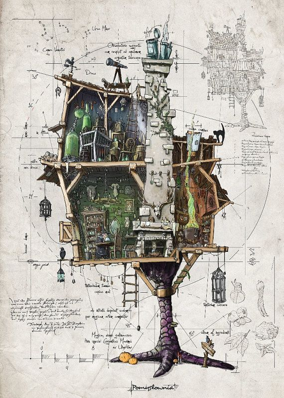

<h3>Мой чердак | My attic</h3>

<h5><i>All the code that I wrote and forgot</i></h5>
 

 

This is my <b>чердак</b> (pronounced <i>cherdak</i>; means <i>attic</i> in
Russian), where I store all those scripts that have nowhere else to go. Here you
find dusty, old pieces of code that I had long since forgotten about (e.g. the
<code>astrochymist.py</code> script); scripts that never got to turn into an
entire package, either because they were no longer needed (e.g. the
<code>kiln.py</code> script), or because they were too small to be turned into
one (e.g. the <code>origamist.py</code> script); some scripts have since become
packages of their own (e.g. the <code>astromoles.py</code> script, which became
the <a href="https://github.com/astrogewgaw/spacetar"><b>spacetar</b></a>
package), or have become part of other packages (e.g. the
<code>galmsps.py</code> script, which became part of the <a
href="https://github.com/mattpitkin/psrqpy"><b>psrqpy</b></a> package). Some
scripts have never been used, while others are used almost on the daily. <a
href="https://en.wikipedia.org/wiki/Milliarium_Aureum"><b>All roads lead to the
attic!</b></a>
  
Each script is self-documenting, meaning that if you use the <code>--help</code>
flag with any script, you should get a small help text explaining what it does
and how to use it. Most of the scripts are written in <b>Python</b>, at least
for now. I am still in the process of transferring code from all the nooks and
crannies of my computer to this repository, so some of the scripts are still
empty. All scripts (like most of my other work) are licensed under the MIT
License. Feel free to use/modify them as you wish. Of course I will very happy
if you attribute my work to me, or if you let me know that you find something
from here useful :grin: ! Some of the code is weird on purpose (for instance,
check out the <code>astrochymist.py</code> script), but then that's how attics
are, right?

 

<b>Copyright (c) 2022 <a href=https://github.com/astrogewgaw>Ujjwal Panda</a></b>

